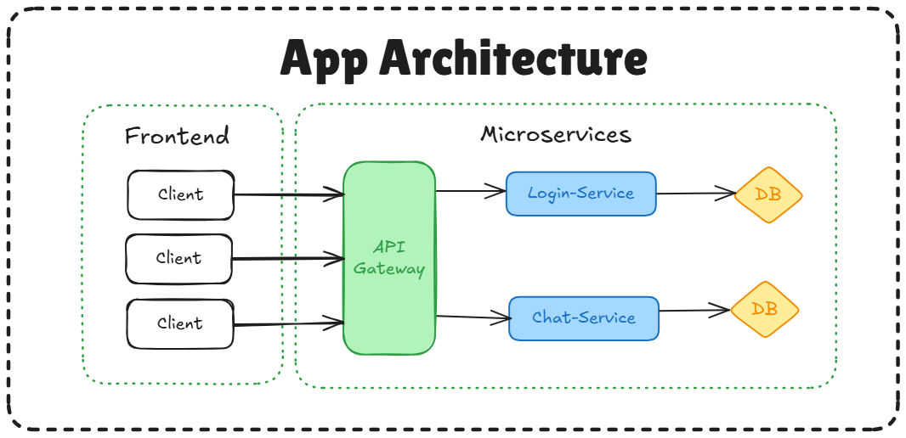

🗨️ Microservice Chat App
=========================

A **chat application** built using a **microservice-oriented architecture** with **Node.js**, **Express**, **Docker**, and **Docker Compose**. This app features two distinct services for **authentication** and **chat**, a centralized **API Gateway**, and database separation using **MSSQL** and **MongoDB**. Authentication is handled through **serverless login sessions** using **JWTs** stored in **HTTP-only cookies** for Security best practices. Implemented a simple **Role-Based Access Control** (RBAC) ideal for scaling and adding complexity to the application.

📦 Architecture Overview
------------------------

This application is divided into the following main components:



### The Frontend

*  The UI for the application

*  Featuring 2 screens, one for login/register and one for the chat

*  Written in HTML and CSS (generated by DeepSite)

### 🔐 Login Service

*   Handles user **authentication** and **registration**.
    
*   Uses **MSSQL** as the database.
    
*   Built with **Express** on **Node.js**.
    

### 💬 Chat Service

*   Handles **sending text messages** functionality between users.
    
*   Stores messages in a **MongoDB** database.
    
*   Also built using **Express** and **Node.js**.
    

### 🔀 API Gateway

*   Acts as a **reverse proxy**, routing client requests to the appropriate backend service.
    
*   Dynamically associates each request path with the correct service (login or chat).
    
*   Built with **Express**.
    

🐳 Containerization
-------------------

The entire application is containerized using **Docker** and orchestrated with **Docker Compose**.

Run this in a terminal, in the root folder where **`docker-compose.yml`** is located

```terminal
docker-compose up --build
```

Each service runs in its own isolated container:

*   login-service (Node.js + MSSQL) **`port: 3000`**
    
*   fontend **`port: 3001`**
  
*   chat-service (Node.js + MongoDB) **`port: 3002`**
    
*   api-gateway **`port: 4000`**

    

📁 Folder Structure
-------------------


Each service folder contains its own:

*   Dockerfile
    
*   Express server setup
    
*   Database connection logic
    
*   API routes
    

🖼️ Project Images
------------------


*   **System Architecture Diagram**
    
*   **Docker Container Network Overview**
    
*   **App UI Screenshots**
    
*   **Database Schema Snapshots (MSSQL & MongoDB)**
    

🚀 Getting Started
------------------

### Prerequisites

*   Docker & Docker Compose
    
*   Node.js (for local testing)
    
*   MSSQL & MongoDB images are pulled automatically
    

### Steps to Run

The services will be available at:

*   API Gateway: http://localhost:4000
    
*   Login Service (via gateway): http://localhost:4000/api-gateway/auth
    
*   Chat Service (via gateway): http://localhost:4000/api-gateway/chat
    

🧪 API Endpoints
----------------

### Login Service

*   POST /auth/login **`Route for user login`**

*   POST /auth/register **`Route for user registration`**
    
*   GET /auth/getUser **`Route for jwt token verification`**


### Chat Service

*   POST /chat/messages   **`Route to send a message`**
    
*   GET /chat/messages/:userID2  **`Route to get chat history between two users`**

*   GET /chat/conversations  **`Route to get chat history for a specific user`**
    

📌 Future Improvements
----------------------

*   Add WebSocket support for real-time messaging.
    
*   Improve API security (rate limiting, input validation).
    
*   Add user presence and typing indicators.
    
*   Write unit/integration tests for all services.
    

📄 License
----------

This project is licensed under the MIT License.
